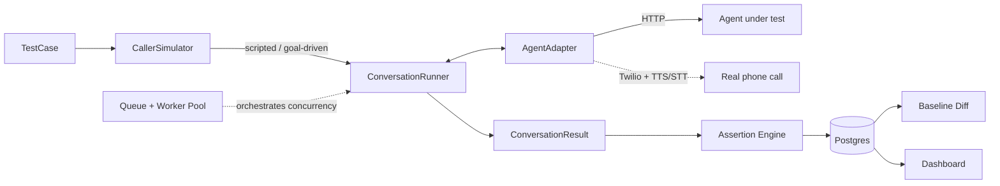

# Voice Regression Lab

**Regression testing for voice AI agents.** Define a caller persona and what "correct" looks like, run it against any agent — your own, or a real one over the phone — and get a pass/fail report with a full transcript, diffed against the last known-good run.

---

## 1. What I built

A framework that treats a phone conversation the way a normal test suite treats a function: give it inputs, define expected outcomes, run it, get pass/fail.

Concretely, it's:

- A **test-case data model** — a caller persona (scripted or goal-driven), a set of assertions, stored in Postgres.
- A **pluggable adapter layer** — abstracts "send a turn, get a reply" over any agent, whether it's your own service or a third party's API you don't control the shape of.
- A **caller simulation engine** — plays either a fixed script, or a goal-driven persona (an LLM that reacts naturally until it succeeds, fails, or hangs up).
- An **assertion engine** — keyword/regex checks, tool-call verification, latency and turn-count thresholds, plus an optional LLM-judge for fuzzier criteria like tone.
- **Baselines and diffing** — every run is stored; one run per (test case, agent) is the accepted baseline; new runs are diffed against it turn-by-turn, so you see exactly what changed, not just that something did.
- A **concurrent test runner** — a queue and worker pool that fans a whole suite out with real concurrency, retries, and timeouts.
- A **dashboard** — run history, pass/fail trends, latency charts, transcript diffs.
- A **CI-ready CLI** — exits non-zero on failure, wired into a GitHub Action that comments results on every pull request.
- An **optional phone layer** — places a real call, speaks via TTS, transcribes the agent's replies via STT, and runs the exact same assertion engine against a live conversation instead of a text API.

None of it tries to be a voice AI. The LLM only ever plays the *test's* caller persona or judges a transcript — it never generates the behavior under test. That's the whole point: this is infrastructure *around* a voice agent, not a voice agent.

## 2. Why this

Conversations are non-deterministic. Every prompt tweak, model swap, new tool, or new business flow can silently break behavior that used to work — the agent stops asking for a phone number, starts quoting a price it shouldn't, forgets to transfer to a human on request, or takes twice as many turns to finish a booking. You can't diff conversational output the way you'd diff a JSON API response, so most teams catch these regressions the slow way: someone manually calls the agent and listens.

That doesn't scale past a handful of test calls, it's inconsistent between whoever happens to be testing that day, and by construction it means the bug reaches a real caller before anyone notices. This is the same problem web and mobile teams solved years ago with snapshot and end-to-end testing — voice AI just doesn't have an equivalent yet.

## 3. How to use it

```bash
git clone https://github.com/Nakshatra-thange/voice-regression-tester && cd voice-regression-tester
npm install
cp .env.example .env        # Postgres URL, Anthropic key, Redis URL
npx prisma generate
npx prisma migrate dev
npm run seed                 # a reference agent + a few sample test cases
npm run dev:all              # reference agent + worker + dashboard
```

Define a test case once:

```ts
await db.testCase.create({
  data: {
    name: "Book a cleaning - happy path",
    mode: "GOAL_DRIVEN",
    personaPrompt: "A polite adult who wants to book a routine teeth cleaning next Tuesday afternoon.",
    goal: "Get a confirmed appointment booked for a teeth cleaning next Tuesday afternoon.",
    maxTurns: 6,
    assertions: {
      create: [
        { type: "TOOL_CALLED", config: { type: "TOOL_CALLED", toolName: "book_appointment" } },
        { type: "NOT_CONTAINS_KEYWORD", config: { type: "NOT_CONTAINS_KEYWORD", keywords: ["$", "price"], role: "agent" } },
        { type: "MAX_LATENCY_MS", config: { type: "MAX_LATENCY_MS", maxPerTurn: 4000 } },
      ],
    },
  },
});
```

Then run it whenever the agent changes:

```bash
npm run test:voice -- --version v1.0.0 --tag booking
npm run promote-baselines    # first run: accept it as the known-good baseline
```

Change a prompt, re-run under a new version tag, and check the dashboard — any assertion that flipped is flagged, with the exact transcript turn that changed highlighted against the baseline.

```bash
npm run test:voice -- --version v1.0.1 --tag booking
```

Wire the same CLI into CI (`.github/workflows/voice-regression.yml`) and every pull request gets an automatic pass/fail comment before anything merges.

## 4. Why is it helpful

- **Turns manual QA into a signal you can trust.** Pass/fail and a diff, not "I called it and it sounded fine."
- **Catches regressions before a customer does.** Runs on every prompt or model change, not on a release-day scramble.
- **Adapter pattern means it's not locked to one agent.** Point it at a text API, a different LLM provider, or a real phone number without touching the test suite itself.
- **Scales like a real test suite.** Concurrency, retries, and timeouts via a proper queue, not a for-loop that falls over past a handful of tests.
- **Validates the real thing, not a proxy for it.** The optional phone layer tests over an actual call — STT, TTS, and telephony latency included — not just a mocked HTTP request.
- **Fits into an existing engineering workflow.** CI-native from day one: a failing suite blocks a merge the same way a failing unit test would.

## 5. Architecture



**Data flow:** a `TestCase` defines a persona and its assertions → the `CallerSimulator` drives the conversation, turn by turn, through an `AgentAdapter` that abstracts away whatever transport the agent under test actually uses → every turn and every assertion result is persisted → the diff engine compares the new run against whichever run is flagged as that test case's baseline → the dashboard renders all of it, and the CLI turns the same result into a CI exit code.

**Stack:** Node.js, TypeScript, Next.js, Postgres (Prisma ORM), Redis + a job queue for concurrency, and an LLM API for the goal-driven caller persona and the LLM-judge assertion type. The phone layer adds a telephony provider plus TTS/STT providers, kept behind the same adapter interface as everything else.

---

Built as an exploration project to answer one question: what does CI for a conversation actually look like?
